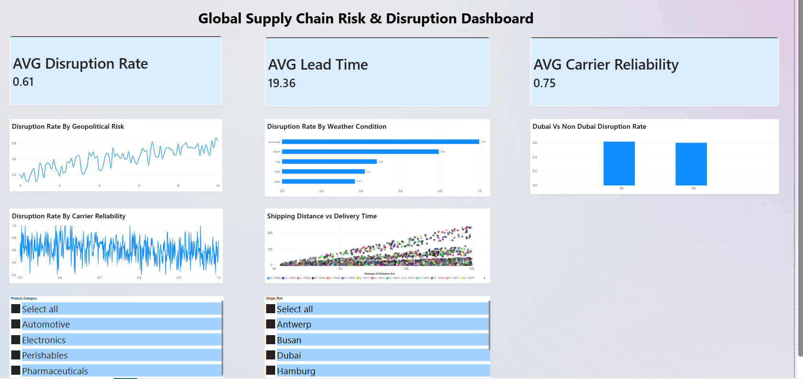

# Global Supply Chain Risk & Disruption Dashboard

Power BI dashboard analyzing 5,000 global shipment records to identify 
key drivers of supply chain disruption, including geopolitical risk, 
weather conditions, and carrier performance.

## Objectives

- Identify which factors most strongly predict shipment disruption
- Evaluate whether carrier reliability scores actually reduce disruption risk
- Assess whether Dubai-linked shipments carry higher or lower risk 
  compared to the global average
- Examine the relationship between shipping distance and delivery lead time
- Build an interactive dashboard that allows filtering by product category 
  and origin port for ongoing commercial reporting use

## Key Findings

1. **Geopolitical risk is a strong predictor of disruption** — disruption 
   rate climbs steadily from ~40% at low-risk scores to 90%+ at high-risk 
   scores.

2. **Weather severity strongly predicts disruption**:
   - Hurricane: 100%
   - Storm: 80%
   - Fog: 48%
   - Rain: 42%
   - Clear: 37%

3. **Carrier reliability score shows no meaningful relationship with 
   disruption** — rates stayed noisy (40%–100%) across the full reliability 
   range, suggesting external factors outweigh carrier-level performance.

4. **Dubai-linked shipments perform at or slightly better than average** — 
   23% of total volume (1,169 of 5,000 shipments), with a 60% disruption 
   rate vs. 62% for non-Dubai shipments.

5. **Shipping distance and delivery lead time are positively correlated**, 
   confirming the dataset reflects realistic, internally consistent 
   shipping patterns.

## Data Quality

The dataset was already clean (no missing values, no duplicates, consistent 
date formats) and required no preprocessing before analysis. Data quality 
was verified prior to building the dashboard.

## Tools Used

Power BI — DAX for calculated columns and measures, interactive slicers 
(Product Category, Origin Port), and custom visual formatting.

## Dashboard Preview

